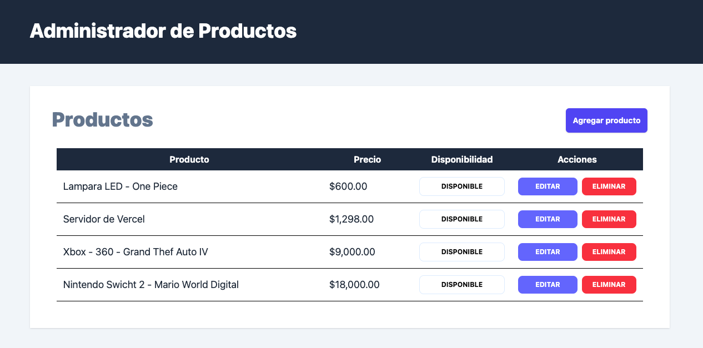
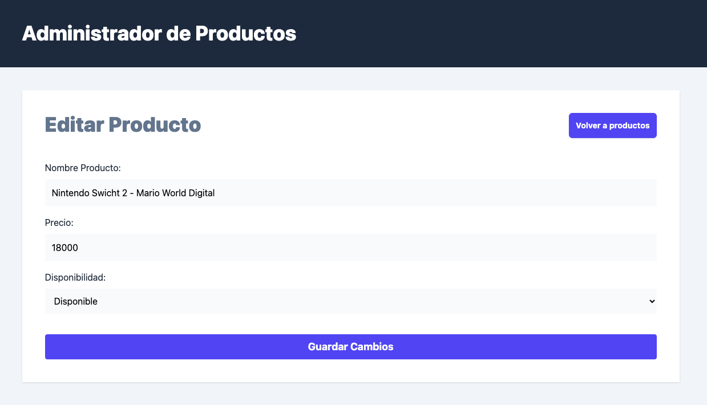

# FRONT REST API REACT/TypeScript
React Web Platform connected to an API hosted on a Node 22.14 + PostgreSQL 16.9 server ( PERN )


## Technologies
React + Typescript + TailwindCSS + Axios + Zod + Valibot + React Router
## Developer Notes
### Managed with Data API by React Router
#### src/router.ts
```
import { createBrowserRouter } from "react-router-dom";
import Layout from "./layouts/Layout";
import Products , { action as updateAvailabilityAction , loader as productsLoader } from "./views/Products";
import NewProducts , { action as newProductAction } from "./views/NewProducts";
import EditProduct, { loader as editProductLoader , action as editProductAction } from "./views/EditProduct";
import { action as deleteProductAction } from "./components/ProductsDetails";

export const router = createBrowserRouter([
    {
        path:'/',
        element: <Layout />,
        children:[
            {
                index: true,
                element: <Products />,
                loader: productsLoader,
                action: updateAvailabilityAction
            },{
                path:'productos/nuevo',
                element: <NewProducts />,
                action: newProductAction
            },{
                path: 'productos/:id/editar', // ROA Pattern - Resource-oriented desing
                element: <EditProduct />,
                loader: editProductLoader,
                action: editProductAction
            },{
                path:'productos/:id/eliminar',
                action: deleteProductAction
            }
        ]
    }
])
```
#### src/services/ProductService.ts
```
import { safeParse , number , parse, pipe, transform , string } from "valibot";
import { DrafProductSchema , ProductSchema, ProductsSchema, type Product } from "../types";
import axios from "axios";
import { toBoolean } from "../helpers";

type ProductData = {
    [ k: string ] :FormDataEntryValue
}

export async function addProduct( data : ProductData  ) {
    
    try{
        const result = safeParse( DrafProductSchema , {
            name: data.name,
            price: +data.price
        } )
        if( result.success ){
            const url = `${ import.meta.env.VITE_API_URL }/api/products`

            await axios.post( url , { 
                name: result.output.name,
                price: result.output.price
             } )

             
        }else{
            throw new Error(' Datos no válidos ')
        }
        
    }catch(error){
        console.log( error );
    }

}

export async function getProducts() {
    try{
        const url = `${ import.meta.env.VITE_API_URL}/api/products`
        const { data } = await axios( url )        
        const result = safeParse( ProductsSchema , data.data )
   
        if( result.success ){
            return result.output
        }else{
            throw new Error('Hubo un error...')
        }
        
    }catch(error){
        console.log(error);
    }
}

export async function getProductsById( id : Product['id']) {
    try{
        const url = `${ import.meta.env.VITE_API_URL}/api/products/${id}`
        const { data } = await axios( url )        
        const result = safeParse( ProductSchema , data.data )
        
        if( result.success ){
            return result.output
        }else{
            throw new Error('Hubo un error...')
        }
        
    }catch(error){
        console.log(error);
    }
}

export async function updateProduct( data : ProductData , id : Product['id'] ) {
    
    try{
        const NumberSchema = pipe( string(), transform(Number) , number() )

        const result = safeParse( ProductSchema , {
            id,
            name: data.name,
            price: parse( NumberSchema , data.price ),
            availibility: toBoolean( data.availability.toString() )
        })
        
        if( result.success ){
            const url = `${ import.meta.env.VITE_API_URL}/api/products/${id}`
            await axios.put( url , result.output)
        }
        
    }catch(error){
        console.log(error);
        
    }
    
}
```
